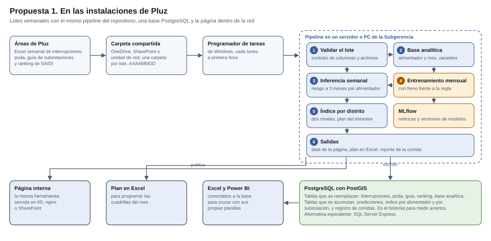
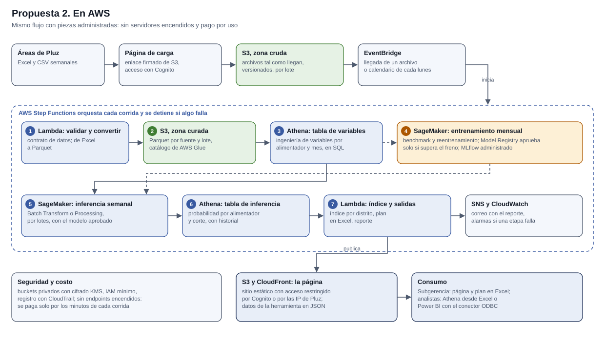

# Prototipo de priorización de poda. Piloto Los Olivos

Herramienta que la Subgerencia MT/BT de Pluz Energía pidió en la reunión N°2: un mapa de calor interactivo del índice de criticidad por interferencia de vegetación, con el plan de poda priorizado del trimestre. Desde la reunión N°3 incluye además la comparación del piloto con otros siete distritos de Lima Norte.

Proyecto del curso DS5045, Ciencia de Datos Computacionales. Pluz Energía y UTEC.

Los datos de la página se generan con el pipeline de la carpeta pipeline, que convierte cada lote semanal de Pluz en los archivos que dibuja la página. Su documentación completa, con el contrato de datos y la arquitectura propuesta para la operación, está en pipeline/README.md.


## Qué preguntas responde

El tablero está armado alrededor de las cinco preguntas que se hacen en la reunión, y cada pieza contesta una:

* **¿Dónde se concentra el riesgo en el distrito?** El mapa de criticidad.
* **¿Qué unidades entran y en qué orden?** La lista priorizada y las marcas numeradas del mapa.
* **¿Cuánto rinde estirar el plan una unidad más?** La curva de índice y de cobertura acumulada.
* **¿Por qué esta unidad está en este puesto?** La descomposición del índice y las razones del modelo.
* **¿Cómo se lo paso a programación?** La descarga en CSV.

Las cuatro vistas no son cuatro gráficos sueltos: son cuatro lecturas del mismo estado, y cualquiera de ellas puede escribir en él.

* Un clic en una celda del mapa, en una fila o en una barra de la curva fija esa unidad en las cuatro vistas y lleva su fila a la vista en la lista.
* Un clic en un tramo de la escala de color resalta ese rango de índice en el mapa, la lista y la curva.
* Un clic en el código de un alimentador, en la lista o en el detalle, deja solo sus subestaciones en las tres vistas.
* Arrastrar el asa azul de la curva cambia el tamaño del plan, igual que el control de arriba.

Los filtros no cambian el plan. El plan lo fija siempre el tamaño elegido: filtrar sirve para mirar un subconjunto, no para redefinir el programa. Los filtros activos aparecen como etiquetas que se pueden quitar encima de los indicadores, y se borran de una vez con «Quitar todo».


## Qué hace

* Muestra el índice de criticidad de 0 a 100 sobre el distrito de Los Olivos.
* Conmuta entre dos niveles de lectura, alimentador y subestación, con los mismos componentes y los mismos pesos, porque corresponden a dos decisiones distintas: el alimentador es la unidad de programación y la subestación es la unidad de despacho.
* Ajusta el tamaño del plan con un control, de modo que la capacidad se puede discutir en la propia reunión y el mapa, la lista, la curva y el resumen se recalculan a la vez.
* Muestra una ficha por unidad con el índice, la descomposición en sus cuatro componentes frente a la mediana del piloto y las razones principales que entregó el modelo.
* Resume el plan con cuatro indicadores: unidades, clientes de baja tensión cubiertos, SAIDI del último año e interrupciones del último año de los alimentadores del plan. En la vista por subestación, el SAIDI y las interrupciones se cuentan una sola vez por alimentador, aunque varias subestaciones del plan lo compartan.
* Descarga el plan seleccionado en CSV, listo para la programación.
* En la pestaña **Comparar distritos** pone el piloto al lado de uno de siete distritos de Lima Norte: San Juan de Lurigancho, Carabayllo, Callao, Puente Piedra, San Martín de Porres, Ventanilla y Comas. Usa el mismo modelo, los mismos componentes y los mismos pesos; el índice se calcula dentro de cada distrito y los dos mapas comparten la escala de 0 a 100. Las cifras absolutas que sí se comparan entre distritos, como el riesgo estimado, el SAIDI o los cortes por vegetación, van en un panel aparte, con una fila por indicador.


## Cambios tras la reunión N°3

* El encabezado lleva el piloto de Los Olivos de forma explícita.
* Los indicadores de potencia instalada y de índice mínimo se reemplazan por el SAIDI y las interrupciones del último año. La potencia sigue dentro del componente de exposición del índice, pero como cifra suelta no informaba la decisión, y el índice mínimo ya se lee en la lista priorizada.
* La probabilidad ya no usa ninguna de las tres variables del índice de criticidad: ni el SAIDI, ni el número de clientes y la potencia, ni los meses desde la última poda, que salieron en una segunda revisión. Se estaban contando dos veces. El desempeño fuera de muestra no cambia de forma distinguible, y los diez primeros alimentadores del piloto son los mismos.
* Benchmark de ocho modelos con reporte interactivo en D3 y registro en MLflow, y documento de arquitectura con dos propuestas de automatización.
* Nueva pestaña de comparación entre distritos, con la guía de subestaciones de junio de 2026, que cubre toda la concesión.
* Los meses desde la última poda distinguen dos casos que antes se confundían. Un alimentador podado en el mismo mes del corte aparece como «podado este mes». Uno que no figura en el registro de poda, que empieza en enero de 2025, aparece como «sin poda registrada»; antes este segundo caso se mostraba como 24 meses, que es solo el tope que usa el cálculo. El detalle está en pipeline/README.md.
* Los datos se actualizan con un pipeline automático, y las fechas que muestra la página salen de los propios datos.


## Modelo y benchmark

La probabilidad de interferencia a tres meses sale de una regresión logística con el historial de vegetación, la vegetación de los últimos doce meses, las interrupciones de los últimos doce meses y la estacionalidad. No usa ninguna de las tres variables que el índice ya cuenta por su lado: reloj de poda, SAIDI y exposición por clientes y potencia. En la segunda revisión de la reunión N°3 se comparó con la regresión logística ponderada, el refuerzo de gradiente, Random Forest, XGBoost, LightGBM y SVM: ninguno la supera de forma distinguible, de modo que se mantiene por simple, calibrada y explicable. El detalle, y cómo correr el benchmark y verlo en MLflow, está en pipeline/README.md. El reporte del benchmark se publica junto con la herramienta, en la carpeta benchmark del sitio: es la misma dirección de la página seguida de benchmark/.


## Arquitectura para la operación

Dos propuestas para que la herramienta se actualice sola con cada lote semanal de Pluz, con el mismo pipeline: en las instalaciones de la empresa y en AWS. El detalle está en ARQUITECTURA.md.






## Cómo se abre

Basta con abrir index.html en el navegador. La página no hace ninguna petición de red: los datos se cargan con una etiqueta de script, la biblioteca D3 está en el repositorio, los iconos son un sprite SVG en línea y la tipografía es la del sistema. Funciona igual desde el disco, desde un servidor local o publicada.

Para servirla en local y abrirla en el navegador:

```
python pipeline/actualizar.py ver
```

Algunos parámetros en la dirección sirven para compartir una vista concreta o para capturarla en un informe:

* **tema=claro** o **tema=oscuro** fija el tema.
* **nivel=subestaciones** abre directamente la vista por subestación.
* **vista=comparar** abre la comparación de distritos.
* **distrito=SJL** elige el distrito de la comparación. Los códigos son SJL, CAR, CLL, PPI, SMP, VEN y COM.

Por ejemplo, la dirección de la página seguida de ?vista=comparar&distrito=CLL abre la comparación con Callao.


## Cómo se actualizan los datos

Cuando llega un lote de Pluz se guarda en una carpeta nueva dentro de pipeline/datos/lotes, con un nombre que empiece por la fecha en formato AAAAMMDD, y se corre:

```
python pipeline/actualizar.py
python pipeline/actualizar.py ver
python pipeline/actualizar.py subir
```

La primera orden valida el lote, reentrena el modelo, predice los tres meses siguientes al último mes con datos, recalcula el índice de los ocho distritos y reescribe la carpeta data. La segunda abre la página para revisarla. La tercera la publica en GitHub, previa confirmación.

Los Excel de Pluz no se suben al repositorio. El repositorio es público porque lo sirve GitHub Pages, y el archivo .gitignore deja fuera los lotes y las salidas técnicas.


## Cómo se publica en GitHub Pages

1. Subir el contenido de esta carpeta a la raíz de un repositorio, o a su carpeta docs.
2. En Settings, Pages, elegir la rama y la carpeta correspondientes.
3. El archivo .nojekyll ya está incluido para que las rutas se sirvan tal cual.

No hace falta ningún paso de compilación ni ningún servidor de aplicaciones. Todas las rutas son relativas, de modo que la página funciona igual en la raíz del dominio que en una subcarpeta del proyecto.


## Estructura

* **index.html.** Estructura de la página y sprite de iconos.
* **css/estilos.css.** Estilos y paleta, con tema claro y oscuro.
* **js/app.js.** Lógica del mapa, la curva, la lista y las fichas del piloto.
* **js/comparar.js.** Pestaña de comparación entre distritos.
* **js/vendor.** Biblioteca D3, versión 7.9.0.
* **data.** Lo que carga la página: criticidad del piloto, datos de los ocho distritos y geografía. Cada archivo va en dos copias con el mismo contenido: la de extensión js la carga la página, y la de extensión json sirve para reutilizar los datos.
* **assets.** Logotipo completo, isotipo e icono de pestaña.
* **pipeline.** Flujo de datos, del lote de Pluz a la carpeta data. Se documenta en pipeline/README.md.
* **docs.** Diagramas de arquitectura en SVG y el generador que los dibuja.
* **ARQUITECTURA.md.** Propuestas para la operación, en las instalaciones de Pluz y en AWS.
* **benchmark.** Reporte interactivo del benchmark de modelos, publicado como segundo enlace. Lo reescribe la orden benchmark del pipeline.


## Decisiones de diseño

**Color.** Los tres tonos del logotipo son el origen de toda la paleta: azul #395AA1, verde #6CAC5E y amarillo #FCC13F. De ahí salen tres familias, y ninguna hace el trabajo de otra:

* La identidad de interfaz es el azul corporativo: cabecera, controles, foco, selección y el contorno del plan sobre el mapa.
* La magnitud, es decir, el índice, va en una rampa secuencial de un solo tono nacida del amarillo corporativo. Son siete pasos, con luminancia OKLCH monótona de 0,94 a 0,55, saltos de 0,065 y un giro de tono de 37°, dentro del umbral de un solo tono.
* La identidad de serie, es decir, los cuatro componentes del índice, usa cuatro tonos categóricos tomados del logotipo más un violeta como cuarto tono. El peor par adyacente da una diferencia ΔE de 36,9 simulando protanopia y deuteranopia, y de 40,5 con visión normal, muy por encima de los umbrales de 8 y 15. Los pasos del tema oscuro no son una inversión del claro: se eligieron y se volvieron a validar contra la superficie oscura.

El extremo claro de la rampa queda por debajo de un contraste de 3 a 1 contra la superficie, a propósito. Las celdas del mapa se tocan entre sí, de modo que se leen unas contra otras y no contra el papel, y además la cifra va siempre escrita al lado en la lista, en la ficha y en el detalle. Ninguna lectura depende solo del color: la lista ordenada repite la misma información en texto y es la vista de tabla accesible del mapa.

**Proyección.** Las coordenadas llegan en grados decimales sobre WGS 84. Se proyectan con una Mercator transversa rotada al meridiano central del distrito, que es la misma familia de proyección que la zona UTM 18 sur en la que trabaja la empresa. Es conforme, conserva las formas locales y a escala de distrito la distorsión es despreciable. Tratar las coordenadas geográficas como si fueran cartesianas habría estirado el mapa en latitud.

**Mapa de calor.** El mapa se dibuja sobre el límite administrativo real de cada distrito, tomado de OpenStreetMap bajo licencia ODbL 1.0; en Los Olivos se suman las avenidas principales. Los límites se simplifican con el algoritmo de Douglas y Peucker y se guardan en el repositorio, de manera que pesan pocos kilobytes y la página sigue sin pedir nada a la red.

Sobre ese límite se construye un teselado de Voronoi de las subestaciones aéreas, así que cada celda es el área de influencia de una subestación. El recorte contra el distrito lo hace un clipPath de SVG y no un algoritmo propio, porque el límite es cóncavo y el recortador de Sutherland y Hodgman que se usaba antes solo vale para polígonos convexos. Las avenidas van en tinta translúcida y por debajo de todo lo que decide: no aportan ningún dato del modelo, están para que quien conoce el distrito se ubique.

**Fronteras.** Las costuras entre celdas de un mismo alimentador se apagan y solo se dibujan las aristas que separan alimentadores distintos, calculadas sobre la triangulación de Delaunay. Así cada alimentador se lee como un territorio y no como un mosaico de celdas sueltas. El contorno del plan va fino y con una funda clara debajo para que se lea sobre cualquier paso de la rampa: los alimentadores no son territorios contiguos, y en las zonas densas su frontera es de verdad un encaje que un trazo grueso taparía.

**Comparación de distritos.** Los dos mapas usan una escala fija de 0 a 100. El índice es un percentil dentro de cada distrito, de modo que el color compara posiciones relativas; una escala distinta por mapa haría que el mismo tono significara cifras distintas. Lo que sí se compara en términos absolutos va en el panel de cifras, una fila por indicador y cada fila con su propia escala, porque son magnitudes distintas.

**Curva de capacidad.** Son dos gráficos apilados sobre el mismo eje de puesto, nunca dos escalas verticales en un mismo marco. Arriba va el índice de cada unidad, que muestra dónde se aplana la curva; abajo, el porcentaje acumulado de clientes cubiertos, que es el argumento con el que se defiende el tamaño del plan.

**Descomposición del índice.** Los cuatro componentes multiplicados por su peso suman exactamente el índice, así que la barra apilada del detalle no es una metáfora del cálculo: es el cálculo. Cada componente lleva además una marca con la mediana del piloto, porque un 60 suelto no dice si es alto o bajo dentro del distrito.

**Leyenda.** La escala de color lleva encima el histograma de la distribución y la marca del umbral del plan, de modo que una sola pieza explica el color, muestra el reparto y sitúa el corte.

**Etiquetas del plan.** Los Olivos es unas tres veces y media más alto que ancho, de modo que al ajustarlo a la altura del panel sobra margen a ambos lados. Ese margen se usa para nombrar las unidades priorizadas, y cada marca va al lado que le queda más cerca: mandarlas todas a la derecha obligaba a las guías de la mitad izquierda a cruzar el distrito entero.

**Adaptación a pantallas.** El mapa se redibuja al cambiar el tamaño de la ventana, el tablero pasa a una sola columna por debajo de 960 píxeles y el detalle por debajo de 1080. Por debajo de 540 píxeles el mapa renuncia a las etiquetas directas y ocupa todo el ancho.


## Alcance

Es una herramienta de apoyo a la decisión sobre el último corte de datos. No autoriza trabajos ni reemplaza la inspección en campo. Las subestaciones compactas y subterráneas se dibujan en gris porque no están expuestas a interferencia de vegetación. El índice no está validado contra resultados: sus pesos son una propuesta con análisis de sensibilidad, y esa validación es el objetivo del testeo de la reunión N°4.
